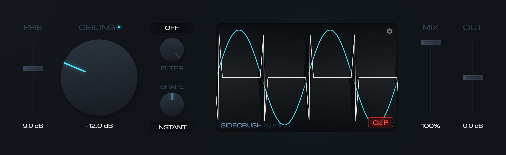

# SideCrush

Were you ever eyeing that dirty crunchy sub distortion for your perfectly clean mix, but didn't want to ruin your exquisitely crisp sub?

SideCrush can satiate your sick needs as a delectable **sidechain-driven dynamic hard clipper** (or a VCA, if you turn CLIP off). VST3 and standalone, by [miruu](https://github.com/miruu-xyz).



It comes with enough settings and knobs to get you well beyond a sub-crunch: anywhere from subtle AM harmonics with **SIGNAL INT**, where the track drives its own lid, to self-splitting stereo carnage with **WTF** and a **CEILING** dragged down low enough that a fly landing on the sidechain slams the lid shut.

## The algorithm

Instead of modulating the volume of the incoming signal from the sidechain, it **drives a clip ceiling that descends into the carrier.**

```
mag  = |lowpass(sidechain)|
t    = clamp((mag - floor) / (ceiling - floor), 0, 1)
lid  = 1 - t^p                p = 2^(-4 * shape)

CLIP on:   out = clamp(carrier * pre, ±lid)
CLIP off:  out = carrier * pre * lid
```

With CLIP off you get clean attenuation: the carrier's detail survives the whole descent, merely scaled towards nothing. With CLIP on a clamp *flattens* the output instead — the full hard-clip crunch you'd get from summing the two signals into a clipper, just without the other signal bleeding through.

Those two can't be morphed into each other by any curve, because the clamp reads the carrier and the multiply doesn't. They agree at exactly two points — fully open and fully shut — and disagree across the entire descent, which is where all the character lives.

There is **no smoothing after the rectifier**: no attack, no release, no envelope follower. The lid tracks the sidechain waveform sample by sample. Smoothing there would turn this into a sidechain compressor, and those already exist.

Full details are in [SPEC.md](SPEC.md).

## Installing

Grab the newest build from the [releases page](https://github.com/miruu-xyz/sidecrush/releases) and drop the `SideCrush.vst3` bundle into your system's plug-in folder:

| | |
|---|---|
| macOS | `~/Library/Audio/Plug-Ins/VST3/` |
| Windows | `C:\Program Files\Common Files\VST3\` |
| Linux | `~/.vst3/` |

**Note:** the plugin is unsigned and unnotarised, so macOS will make a fuss about it. Run this once and it'll shut up:

```bash
xattr -dr com.apple.quarantine ~/Library/Audio/Plug-Ins/VST3/SideCrush.vst3
```

**Important heads up:** this has only been tested on macOS, so I can't promise it runs smoothly on Windows or Linux — CI builds and validates both, but that isn't the same as someone actually using it. If you run into issues, flag them in this repo and I'll try to get to them ASAP.

**Also:** this plugin is fully vibe coded. I provided the idea, the planning, and the UI/UX, but the code base is written by Claude. If you don't fuck with that, or you need the promise of stability, feel free to review the code and open a PR — or skip this one for now.

## Usage

SideCrush is a stereo (or mono) effect with a stereo sidechain input. Route the signal you want crushed into the plugin, route the signal doing the crushing into its sidechain bus, and set **SIGNAL** to **EXT**. With nothing patched into that bus, EXT does exactly nothing — that's your first thing to check if it seems dead.

### Main controls

| | |
|---|---|
| **PRE** | Carrier drive into the lid, −36…+36 dB. The aggression control, and the difference between "barely touched" and "annihilated". |
| **CEILING** | Sidechain level at which the lid slams fully shut, −60…0 dB. The big dial, and the one worth automating. |
| **FLOOR** | Sidechain level below which nothing happens at all. Bottomed out it reads **INSTANT**, meaning the lid moves the moment the sidechain does. Can't be pushed above CEILING; it'll tell you when it's holding. |
| **SHAPE** | Bipolar, −1…+1. Where in that window the lid breaks: late and gentle at CEILING (−1), linear (0), or immediately and hard at FLOOR (+1). |
| **FILTER** | Lowpass on the detector, 20 Hz…20 kHz, then an OFF detent at the top. Click the caption underneath to flip the detector between PRE and POST. |
| **SLOPE** | 6…48 dB/oct, click for the menu. With the filter off it sweeps the cutoff instead, and picking a slope brings the filter back in at 160 Hz. |
| **MIX** | Dry/wet, 0…100%. Latency-compensated, so parallel crushing doesn't comb. |
| **OUT** | Output gain, −36…+36 dB. |
| **CLIP** | Clip ceiling (lit red), or plain VCA ducking (dark). |
| **the scope** | Not just a picture — drag anywhere in it to set CEILING. One pixel of drag is one pixel of threshold, because the display's vertical axis *is* amplitude. |
| **the dot** | Lid-activity LED. Brightness tracks instantaneous gain reduction. |

### Advanced

Behind the gear in the scope's upper right. The scope swaps out for the panel; the ✕ swaps it back.

| | |
|---|---|
| **STEREO / MONO / WTF** | How the detector's two channels relate. STEREO keeps them independent, MONO sums them, WTF splits the sum by sign and hands one half to each channel. The output is always stereo. |
| **WTF** | How far to take WTF, 0…100%, and only shown when the link is on WTF. Right-click for the three settings that have names. |
| **QUALITY** | **HQ** (8× linear phase), **LQ** (4× minimum phase), or **YUCK** (none at all). |
| **FILTER PRE / POST** | Rectifier order. PRE filters the still-bipolar sidechain and stays at waveform rate; POST rectifies first and turns the detector into an envelope follower — at which point the FILTER dial reads in milliseconds, because that's what it's become. |
| **SIGNAL EXT / INT** | External sidechain bus, or the main input driving its own lid. |
| **SCALE** | UI size, 75…150%. A preference, not a parameter, so it stays out of your host's automation list. |

By default everything runs at 8× oversampling, because a hard clip whose threshold moves every sample is about the most alias-prone thing you can build. Both paths need it — the clipper loses roughly 9 dB of alias floor per halving, and the detector can't be run slower and interpolated up, because the interpolation's images land exactly on the decimator's fold points.

So yes, by default this thing is a bit of a CPU hog. **LQ** drops both paths to 4× minimum phase for about a third of the cost, at an alias floor of −60 dB instead of −69 dB. **YUCK** turns oversampling off entirely: 1×, no anti-imaging filter of any kind, a tenth of HQ's CPU, and a −32 dB alias floor. That last one isn't a saving, it's the point — the moving clip folds its own harmonics back down the spectrum and you hear every one of them. If you like that extra *crunch*, if you know what I mean.

Switching quality never moves the reported latency (the cheaper paths are padded back out to match, so no host gets asked to renegotiate delay compensation mid-session) and the swap is ducked over a few milliseconds, because none of the three cascades line up and the seam would otherwise click.

### Some settings worth messing with

**CLIP** is the whole thesis. A multiply attenuates: at the sidechain's peak the output is silent and the carrier's detail is perfectly intact, merely scaled to nothing. A clamp flattens: the output is at full level and the carrier's detail is gone for good. Turn CLIP off if you want a very fast, very rude ducker; leave it on if you want the thing this plugin exists for. Then push PRE and find out how much of the carrier you're willing to lose.

**SIGNAL INT** points the plugin at itself: the main input drives its own lid, and the effect stops being a sidechain trick and becomes a distortion. Your track's own low end clips its own top end at waveform rate, which is amplitude modulation with extra steps — subtle harmonics with a low FILTER and a modest CEILING, complete self-destruction without. No routing required, so it's the fastest way to hear what the thing does.

**WTF** is the third link position and the reason this plugin has a personality. It sums the sidechain like MONO, then splits the sum by sign and hands one half to each channel: the modulator's positive peaks clip only the left, its negative peaks only the right. On a low sub the two clippers take turns and the carrier appears to pan — a pan that comes from two clippers alternating, not from any gain law. In POST the split happens before the filter, so each side gets its own envelope and the pan survives the smoothing. The scope draws it: the aperture's top edge is the left lid and its bottom edge the right, and the output is drawn once per channel — full brightness where the two channels agree, both fading back to 30% where the clippers are taking turns.

The **WTF dial** next to it says how far to take that, and it reaches further in both directions than the switch alone can:

- **0%** closes the split up and hands both channels the same lid. That's MONO.
- **50%** is the behaviour above, and the default.
- **100%** stops throwing away the part of the carrier the lid cuts, and hands it to *both* channels with opposite signs instead — so in stereo it's still there, wide and on the wrong side of the lid, and on the way to mono it cancels.

That last one is about what a mono listener hears. Below 100%, WTF half-cancels when summed: at any instant one channel is clipped and the other isn't, so a phone speaker gets a weaker plugin than the room does. At 100% the sum is *exactly* the MONO link, while the stereo image comes apart.

The top half of that travel also **widens** what the effect invents, up to double — the same thing a Utility patched in after the plugin would do, and mono-blind for the same reason: what it scales goes to one channel and comes off the other, so the sum never sees it. And it only scales the side the effect invented, not the side your input already had, so material the lid isn't touching comes through untouched.

That widening is there to pay for something. 50% sounds like a wider *position* than a bare 100% does, and that isn't a bug: at 50% the lid closing to zero silences one channel outright — a 53 dB alternating level difference, the strongest lateralisation cue there is — and exact mono cancellation makes that impossible, because it forces the two channels to equal level and opposite sign at the moment the lid shuts. Decorrelation is the only kind of width the arithmetic leaves, so 100% takes as much of it as it can get. That costs no headroom at all in PRE, and up to 6 dB of it in POST, where the mono lid is no longer tied to the two split ones. Trim OUT if that matters; the mono sum is unaffected either way.

## Building

If you're one of those crazy people who wants to tinker and build it from scratch, here's how.

Requires CMake 3.22+ and a C++20 compiler. JUCE 9.0.1 is fetched automatically.

```bash
cmake -B build -G Ninja -DCMAKE_BUILD_TYPE=Release
cmake --build build
ctest --test-dir build --output-on-failure
```

The VST3 lands in `build/SideCrush_artefacts/Release/VST3/`, with a standalone app beside it, and is **copied into your user plug-in folder after every build** so it's immediately loadable in a DAW:

| | |
|---|---|
| macOS | `~/Library/Audio/Plug-Ins/VST3/` |
| Windows | `%COMMONPROGRAMFILES%\VST3\` |
| Linux | `~/.vst3/` |

Pass `-DSIDECRUSH_COPY_AFTER_BUILD=OFF` to skip it. CI always does.

On macOS the build produces a universal arm64 + x86-64 binary, because Ableton Live's plug-in scanner still runs as x86-64 even on Apple Silicon and rejects an arm64-only bundle outright. Building without full Xcode works too — Command Line Tools are enough for VST3 and Standalone.

### Tests

Two, both plain executables with no framework, both run by `ctest`:

- `sidecrush_engine_test` — the DSP core in isolation. Asserts the window endpoints, the SHAPE curve, filter stability at 20 Hz with 8 poles, WTF's intensity landing on MONO, the original WTF and an exact mono sum at its three marked settings, that the widening leaves an already-stereo input alone, and the claim the whole plugin rests on: that a clamp flattens where a multiply scales.
- `sidecrush_host_test` — instantiates the real `AudioProcessor` and pushes audio through it across five bus layouts and three sample rates, checking for NaN and verifying state round-trips. It also guards the things most likely to break silently: that the detector's routing shortcuts are bit-identical to the long way round, that WTF actually drives the two channels apart, that WTF at 100% sums back to exactly the MONO link, that changing quality doesn't move the reported latency, that the swap doesn't click, that MIX's dry path is aligned to the reported latency, that OUT trims the blend rather than the wet half, and that FLOOR reads back as capped when CEILING is holding it down.

They use a `CHECK` macro rather than `assert`, because `assert` compiles out under `NDEBUG` and a self-check that vanishes in Release is worse than none.

### Measurement tools

Two more executables that print numbers rather than pass or fail. They are **not** built by default and aren't registered with `ctest` — build them by hand when you touch the DSP:

```bash
cmake --build build --target sidecrush_bench sidecrush_alias
```

- `sidecrush_bench` — where the CPU goes. Cost per block size and sample rate, each quality mode, each sidechain routing, the cost of each oversampler and of the engine loop on its own, and how far the output steps when quality is changed mid-signal.
- `sidecrush_alias` — what the oversampling buys. Alias floor per factor for the clipper and for the detector, FIR against IIR, and how far the finished output moves if the detector's upsampler is swapped for a cheaper one.

Between them they're the evidence for why both paths sit at 8×, why the detector can't simply run slower, and what each quality mode costs. The constants in `PluginProcessor.h` quote their figures, so if you change the DSP, re-run them and update the comments.

### Looking at the GUI

`sidecrush_shot` renders the editor offscreen to a PNG, so you can look at the interface without opening a DAW — or the Standalone, whose wrapper opens the default audio input *and* output and can therefore feed back through your monitors. Also not built by default:

```bash
cmake --build build --target sidecrush_shot
build/sidecrush_shot_artefacts/Release/sidecrush_shot out.png [args...]
```

Arguments are `<id>=<value>` for any parameter (`ceiling=-24`, `clip=0`), plus `audio=<hz>` to push a sub through the sidechain so the scope has something to draw, `hover=<id>` and `drag=<id>[:<dy>]` for interaction states, `settings` for the settings panel, and `crop=x,y,w,h` / `scale=N` for framing. An unknown key is an error rather than a silent no-op, because a typo that quietly renders the default state is worse than useless when the point is comparing against a design.

`tools/pngpick.py` reads pixels back out (`python3 tools/pngpick.py shot.png 640,140`), which is how the palette was matched to `Resources/reference/figma-1-11.png` — the design leans on `color-dodge`, so the layer colours are not the rendered colours.

## Status

Done, as far as the original vision goes. The DSP matches the spec, and the interface implements the Figma design — layout, typeface, dial and fader artwork, the recessed wells, the glows, the oscilloscope overlays, and the hover and engaged states from the file's component variants.

Two known cosmetic gaps: the readouts print the parameters' own strings (`-6.0 dB`) where the design shows a compact `0dB`, and the design's fader caps are parked at a position that doesn't correspond to their labelled value, so cap travel is mapped linearly across the track instead.

If inspiration strikes with additional ideas, or issues and bugs come in, I'll update accordingly. Outside of that, consider this plugin finished for now.

## Licence & copyright

MIT — see [LICENSE](LICENSE). Do whatever you want, but please don't be a dick, and credit me where possible.

Built with [JUCE](https://juce.com) under the free Starter tier; JUCE's own modules remain under the JUCE licence. If you fork this and ship it, you need your own JUCE licence — which is normal, and free below $20k/year.

The interface is set in Zalando Sans Expanded, embedded in the binary under the SIL Open Font Licence 1.1 — see [Resources/fonts/OFL.txt](Resources/fonts/OFL.txt).

Designed with love. By miruu.
